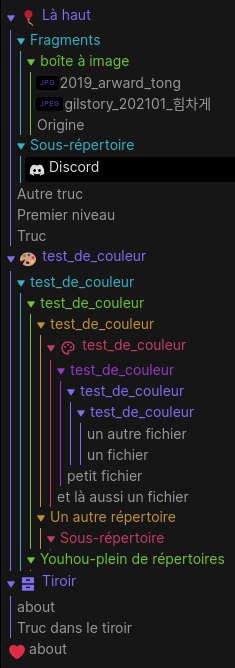
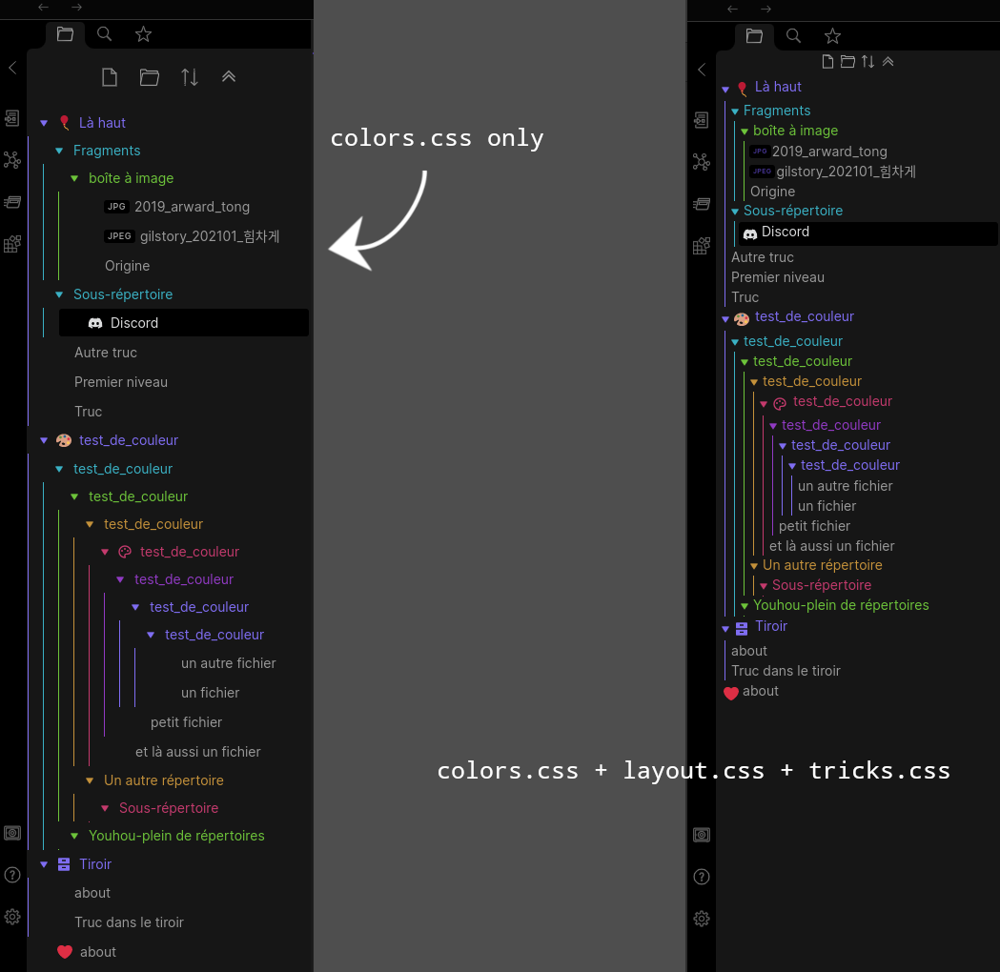

# Evelf's obsidian solution log

## 2022-08-28 Rainbow file explorer

### Screenshot

### Bases

- Theme: Obsidian's Base theme, dark mode
- Plugins with visual impact and their configuration:
  - [Obsidian Icon Folder](https://github.com/FlorianWoelki/obsidian-icon-folder) (note: allows to add icons to files too)
    - activate icons packs
    - to add emojis: copy-paste from elsewhere (e.g. [emojipedia](https://emojipedia.org/))
  - [Obdidian Hider](https://github.com/kepano/obsidian-hider):
    - hide vault name
    - hide scrollbars
- Other useful plugins shown in screenshots:
  - Core Plugin: Stared
  - [Obsidian Collapse All](https://github.com/OfficerHalf/obsidian-collapse-all)

### CSS snippets

I've tried to add useful comments in the CSS themselves.
- The [colors.css](rainbow-file_explorer/evelf-rainbow_file_explorer-colors.css) file defines colors for the folders's title and border, it shouldn't mess with any theme or CSS snippets, and you can customize colors at the beginning of the file.
- To achieve a decent look, you'll also need the [layout.css](rainbow-file_explorer/evelf-rainbow_file_explorer-layout.css) file. The values in that files were defined by trial and error, and you may need to adjust them depending on your theme.
- The [tricks.css](rainbow-file_explorer/evelf-rainbow_file_explorer-other_tricks.css) are just bonus.

